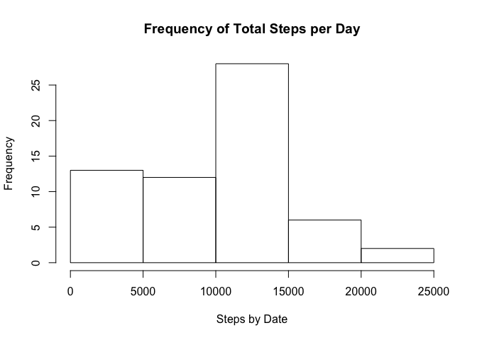
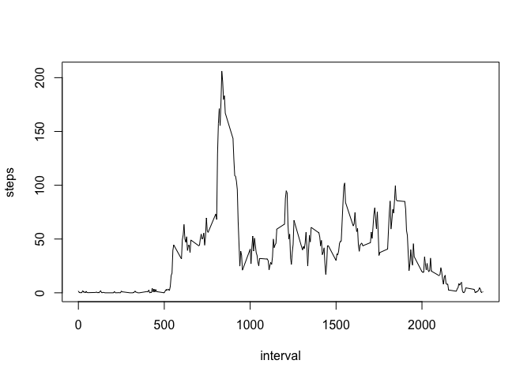
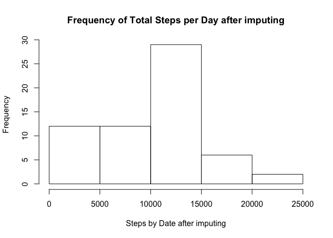
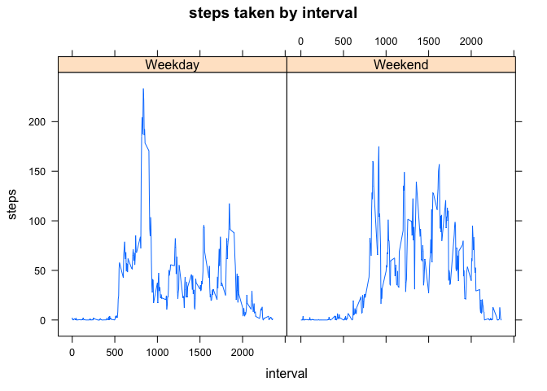

# ReproducibleResearchProject1
Rui  
October 10, 2016  


1.Read csv file

```r
unzip("activity.zip")
dat<-read.csv(file="activity.csv", header=TRUE, sep=",")
head(dat)
```

```
##   steps       date interval
## 1    NA 2012-10-01        0
## 2    NA 2012-10-01        5
## 3    NA 2012-10-01       10
## 4    NA 2012-10-01       15
## 5    NA 2012-10-01       20
## 6    NA 2012-10-01       25
```

2.Histogram of the total number of steps taken each day

```r
library(dplyr)
```

```
## Warning: package 'dplyr' was built under R version 3.2.5
```

```
## 
## Attaching package: 'dplyr'
```

```
## The following objects are masked from 'package:stats':
## 
##     filter, lag
```

```
## The following objects are masked from 'package:base':
## 
##     intersect, setdiff, setequal, union
```

```r
by_date<-group_by(dat,date)   
sum_by_date<-summarise(by_date,steps=sum(steps,na.rm = TRUE))
hist(sum_by_date$steps,xlab="Steps by Date", ylab="Frequency", main="Frequency of Total Steps per Day")
```

<!-- -->

3.Mean and median number of steps taken each day

```r
mean_by_date<-summarise(by_date,mean_steps=mean(steps,na.rm = TRUE))
median_by_date<-summarise(by_date,median_steps=median(steps,na.rm = TRUE))
```

4.Time series plot of the average number of steps taken

```r
by_interval<-group_by(dat,interval)
avg_by_intv<-summarise(by_interval, steps=mean(steps,na.rm=TRUE))
plot(avg_by_intv$interval,avg_by_intv$steps,type="l", xlab="interval",ylab="steps")
```

<!-- -->

5. The 5-minute interval that, on average, contains the maximum number of steps

```r
max_intv<-filter(avg_by_intv,steps==max(avg_by_intv$steps))
print(paste("The 5-minute interval that, on average, contains the maximum number of steps is ", max_intv$interval))
```

```
## [1] "The 5-minute interval that, on average, contains the maximum number of steps is  835"
```

6. Code to describe and show a strategy for imputing missing data. First determine the number of missing cases. Then replace steps with "NA" with the average steps for that specific interval.

```r
print(paste(sum(is.na(dat$steps)), "cases are missing."))
```

```
## [1] "2304 cases are missing."
```

```r
dat_imput<-dat
dat_imput$steps[is.na(dat_imput$steps)]<-avg_by_intv$steps[avg_by_intv$interval==dat_imput$interval[is.na(dat_imput$steps)]]
```

7. Histogram of the total number of steps taken each day after missing values are imputed

```r
by_date_imput<-group_by(dat_imput,date)   
sum_by_date_imput<-summarise(by_date_imput,steps=sum(steps,na.rm = TRUE))
hist(sum_by_date_imput$steps,xlab="Steps by Date after imputing", ylab="Frequency", main="Frequency of Total Steps per Day after imputing")
```

<!-- -->

8. Panel plot comparing the average number of steps taken per 5-minute interval across weekdays and weekends

```r
dat_imput$weekday<-weekdays(as.Date(dat_imput$date))
dat_imput$weekday[dat_imput$weekday %in% c('Monday','Tuesday','Wednesday','Thursday','Friday')]<-'Weekday'
dat_imput$weekday[dat_imput$weekday %in% c('Saturday','Sunday')]<-'Weekend'
dat_imput_avgweek<-aggregate(steps~interval+weekday, data=dat_imput, FUN = mean)
library(lattice)
xyplot(steps~interval|weekday,data=dat_imput_avgweek,type = "l",main="steps taken by interval")
```

<!-- -->

